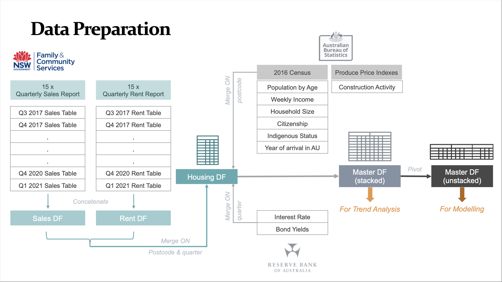
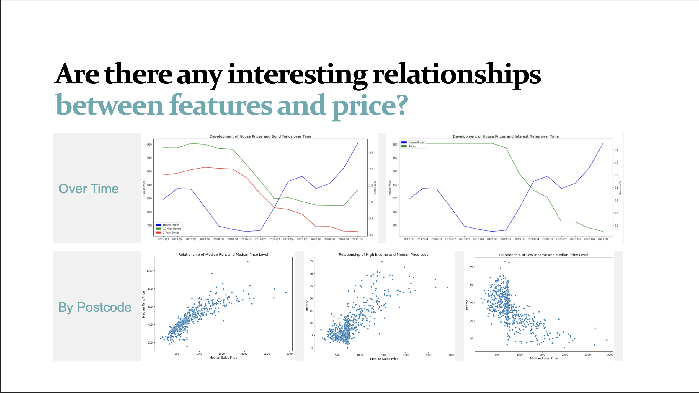
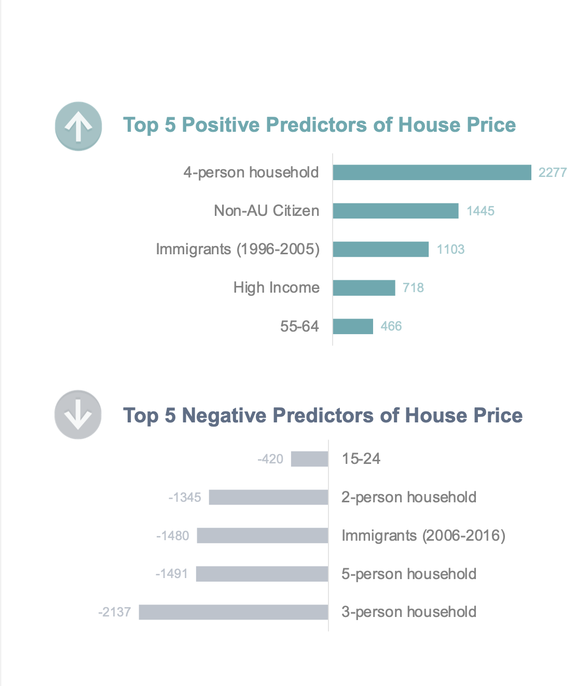
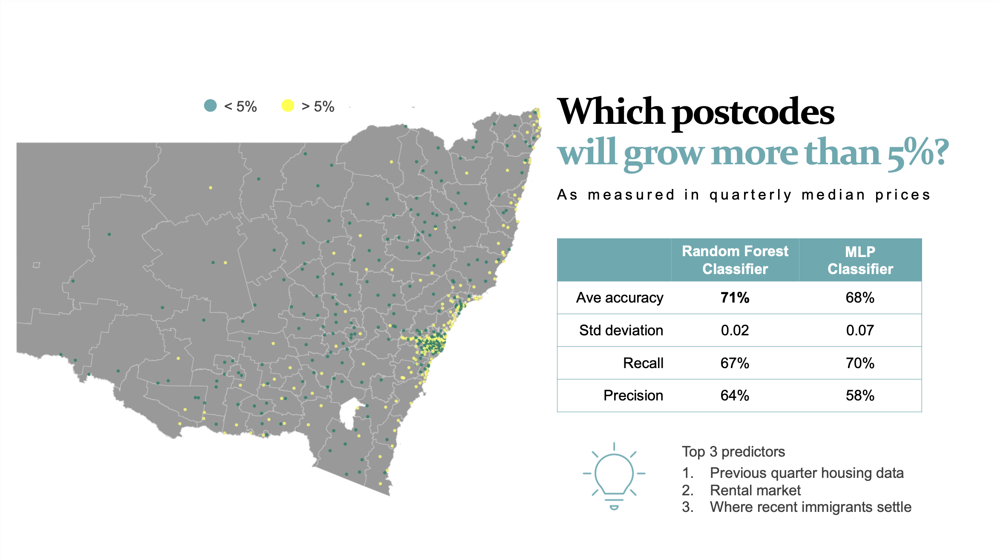
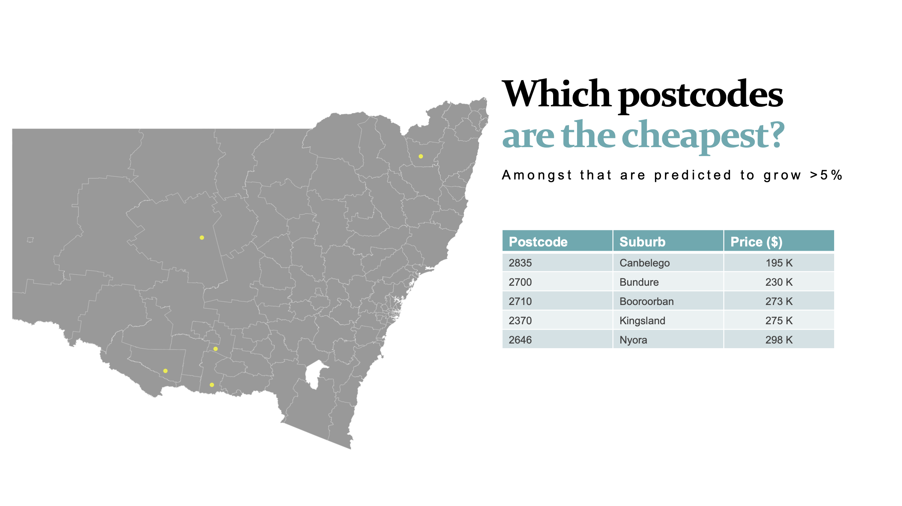

# NSW Housing Data 🏘️ 🇦🇺


#### ℹ️  &nbsp; Team Members 

| Name                    |  |
| ------------------------|-----------------------------------------------------------------------------|
|  Felix Rosenberger      | [Felix's](https://www.linkedin.com/in/felix-rosenberger-1522761b3/)         |
|  Christopher Rudolph    | [Christopher's](https://www.linkedin.com/in/christopher-rudolph-b6bb868b/)  |
|  Ken Walther Sy         | [Ken's](https://www.linkedin.com/in/walthersy/)                             |
|  Jingran Zhao           | [Jingran's](https://www.linkedin.com/in/alexis-zhao-3a541940/)              |


<br> <br />
# Project Summary 
In this project, we have chosen to analyse the property prices in NSW, Australia. 

Given the real estate market activity in NSW, we were curious to see how the relationship between housing data, demographics, 
and certain economic factors interact with one another. 
Also, we were curious whether we could predict housing data in each postcode with these variables.

We explored questions such as:
- [x] Where should one buy a home?
- [x] Can we predict prices based on socioeconomic data such as income levels, household size, or interest rates?
- [x] Can we predict which postcodes will grow faster than average?

# Data Preparation


We collected datasets from:
- [NSW Family & Community Services](https://www.facs.nsw.gov.au/resources/statistics/rent-and-sales/back-issues)
- [Australian Bureau of Statistics](https://www.abs.gov.au/statistics/microdata-tablebuilder/tablebuilder) 
- [Reserve Bank of Australia](https://www.rba.gov.au/)

These are cleaned under the *Data Preparation Notebooks*.

# Variable Relationships


In-depth analysis covered under *Main Notebook.ipynb*

# Top Predictors of House Prices in NSW


# Which postcodes will grow more than 5% in the next quarter?


Apparently, there are several postcodes outside of Sydney that are projected to grow more than 5% in the following quarter.


# Among these high growth areas, which are the cheapest?


These are postcodes have the lowest median house prices that are projected to grow more than 5% in the following quarter. This piece of insight can be very valuable especially for first-time home buyers looking into the real estate market.


# Libraries and packages
```pyrex
import pandas as pd
import numpy as np
import matplotlib.pyplot as plt
import matplotlib.patches as mpatches
import seaborn as sns
import os

from sklearn.preprocessing import StandardScaler
from sklearn.linear_model import LinearRegression
from sklearn.ensemble import RandomForestClassifier
from sklearn.neural_network import MLPClassifier

from sklearn.cluster import KMeans
from scipy.cluster.hierarchy import linkage
from scipy.cluster.hierarchy import dendrogram
from scipy.cluster.hierarchy import cut_tree

from sklearn.model_selection import train_test_split, cross_val_score, cross_val_predict
from sklearn.model_selection import GridSearchCV, KFold, StratifiedKFold
from sklearn.feature_selection import RFE
from sklearn.metrics import accuracy_score, r2_score, mean_squared_error, confusion_matrix

import geopandas as gpd
from mpl_toolkits.axes_grid1 import make_axes_locatable
from shapely.geometry import Point, Polygon
```

Other packages are also required to be installed:
```
pip install geopandas
pip install -U mapclassify
```

# Notebook Structure

* **Main Notebook** - This is where the codes for the main part of the analysis and predictive modelling are
* **Data Preparation Pt1 (NSW Housing data)** - This notebook is where we cleaned all the files for the NSW Housing data
* **Data Preparation Pt2 (Feature data)** - This notebook is where we cleaned all the features that we used
* **Variable Analysis** - This is where we deep-dive into the analysis of all the variables
